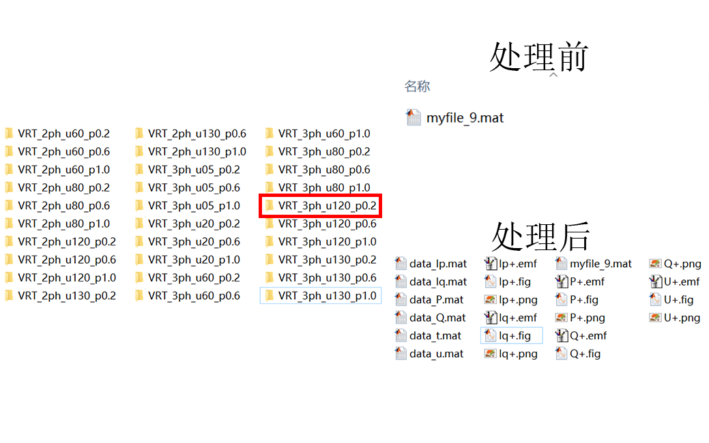
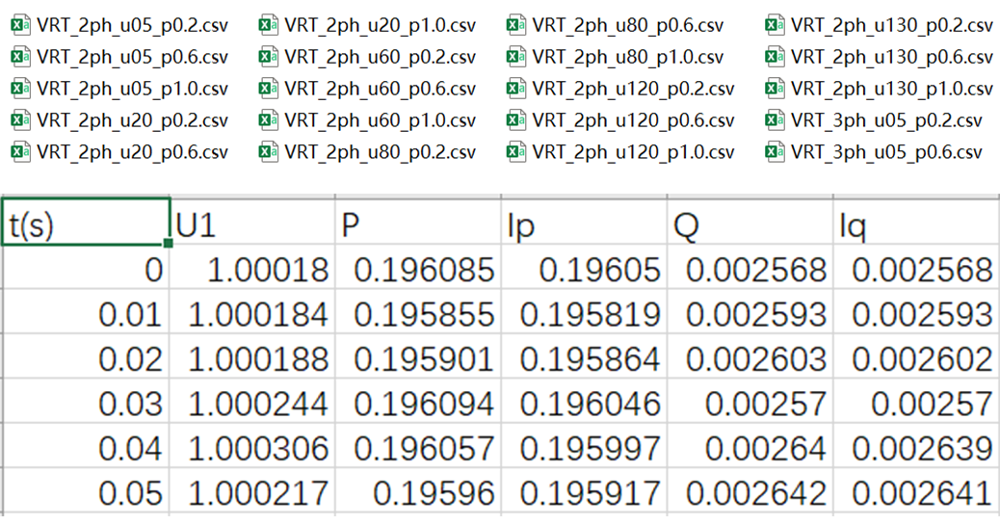
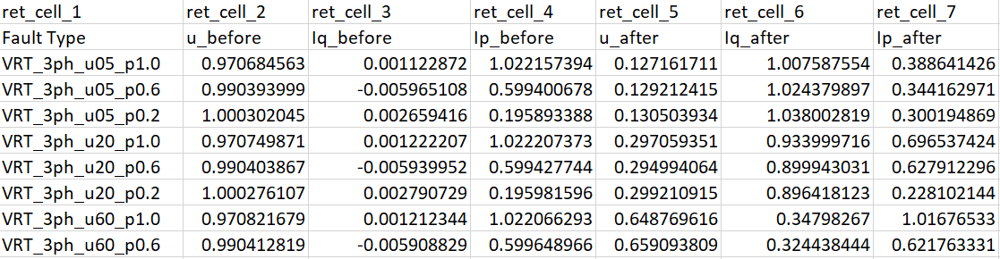
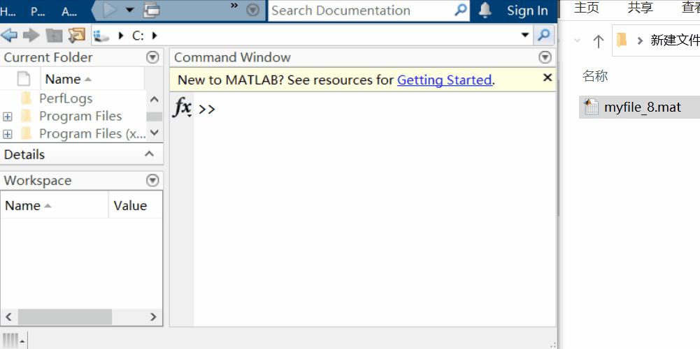
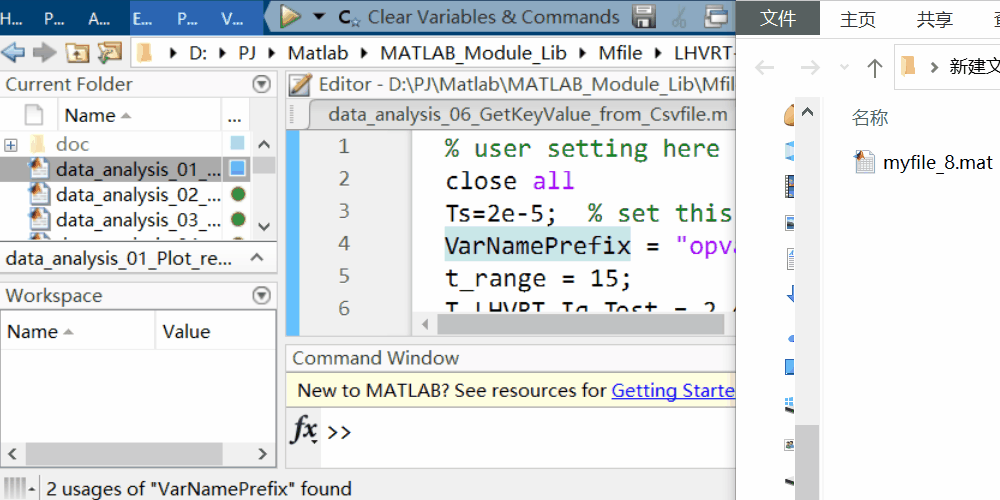
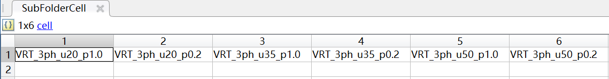

# 机组硬件在环测试数据处理程序使用方法

##  序言


## 一、 各程序简要介绍

`data_analysis_01_Plot_result.m`  
把录波数据拖进去，点一下运行就能plot各种波形。一般是为了看一眼波形是否符合标准。  


`data_analysis_02_Postprocess_Batch.m`  
批量处理录波数据。当各工况的.mat文件已保存到按一定规律命名的文件夹内之后，可以一键完成数据导出、plot波形操作。

`data_analysis_03_Mat2Csv4BPA.m`  
将导出的各项数据`data_t`, `data_u`, `data_p`, ...等转换为BPA或ADPSS校核所需的CSV文件。

`data_analysis_06_GetKeyValue_from_Csvfile.m`  
从导出的各工况CSV中抽取故障前后关键数据，用于BPA拟合阶段机组策略的辨识。关键数据包括故障前电压、有/无功电流，故障期间电压、有/无功电流。

`f_sequence_gen_recursive.m`  
子程序，会被上述程序调用，存在即可，无需修改。

## 二、 工作流推荐

如果考虑数据处理，半实物测试可简单分为3个阶段：策略调试、批量实验、数据后处理。下面分别介绍各阶段数据处理程序的使用。

1. 策略调试：本阶段对机组进行各严苛工况进行测试，期间可能需要反复查看不同工况的波形，确保满足标准要求。由于RTLAB软件录波机制的原因，录波文件名、变量名均会随着实验次数变化，如myfile_1, myfile_2... 反复重命名这些文件或在.m文件中修改变量名十分麻烦。可以使用  
	`data_analysis_01_Plot_result.m`  
   该程序能够自动识别不同后缀的变量，测试人员将录波文件拖入MATLAB后点击运行即可查看曲线。

2. 批量测试：**这一阶段不涉及任何数据处理，但按照推荐的方法规范文件与文件夹命名，有助于后续的批量化操作**。当确定机组满足各项标准后，集中将所有工况测试一遍，并保存录波文件。为了方便程序对数据进行批处理，建议通过如下方法对录波数据进行保存。每个工况建立一个文件夹，文件夹命名体现工况设置情况。如对于三相对称低穿20%大风工况，可命名为3ph_u20_p1.0，两相不对称高穿130%小风工况，可命名为2ph_u130_p0.2. 可以看出，这里通过三个字段对工况进行定义，1）对称/不对称：3ph/2ph；2）电压幅度：uXX%；3）机组出力：p1.0/p0.2. 这三个字段之间通过连接符（下划线）连接。这三个字段的顺序可以随意更改，甚至连接符也可以省略。但尽量不要通过LVRT和HVRT对低穿、高穿分别命名。因为这样需要处理2次，稍微麻烦一些。

	| 推荐的命名方式 | 不太推荐的命名方式 | 
	| ---- | ---- | 
	| 3ph_u20%_p1.0 | LVRT_20_xxx |
	| 2ph_u130%_p0.2 | HVRT_130_xxx |
	
	另外，不太推荐将所有录波数据文件（.mat）放在同一个文件夹中。因为批量处理时，程序会将每个工况处理后的文件放入对应工况的文件夹中，上述策略会让输出文件之间产生冲突。推荐的方式如下图所示

	


3. 数据后处理：因为每个机型测试中信号的录波顺序各不相同，为了方便后续特性拟合与波形回看，需要将录波数据按照一定的数据格式导出、保存、归档。
   
   1）需要导出、归档的数据：
   * 仿真时间: `data_t`， n×1 列向量
   * 正序电压（标幺值）: `data_u`
   * 有功功率（标幺值）: `data_P`
   * 无功功率（标幺值）: `data_Q`
   * 有功电流（标幺值）: `data_Ip`
   * 无功电流（标幺值）: `data_Iq`  

	将上述6组数据，单独作为.mat文件保存出来。

	为了方便后续回看波形，建议将波形绘制并保存下来。格式分别为png/emf/fig。png格式兼容性强；emf为矢量图，便于无损插入word；fig本身包含数据，便于通过MATLAB打开分析。
	
	运行`data_analysis_02_Postprocess_Batch.m`，程序可以循环处理每个工况文件夹内的原始数据，并将处理后的.mat和图像文件保存到对应文件夹内。如下[图1](#fig1)所示

	<div id="fig1"></div>
	  

	图 1  文件夹目录结构与命名方式

   2）需要交接给后续BPA、ADPSS校核的数据：
   BPA、ADPSS建模需要不同采样频率的CSV数据，BPA为10ms，ADPSS为100us。还需要将1）中的各项.mat文件转化为CSV。
	运行`data_analysis_03_Mat2Csv4BPA.m`，程序会循环读取各工况文件夹内的`data_t`, `data_u`...等数据，依照设定批量导出CSV文件。导出的CSV文件如[图2](#fig2)所示。

	<div id="fig2"></div>
	  	

	图2  导出的CSV文件示例

	除此之外，还需要导出各工况关键参数。关键参数包含了故障前、故障期间的电压、有功/无功电流值，可用于观察、归纳机组策略是否与描述一致。
	运行`data_analysis_06_GetKeyValue_from_Csvfile.m`，程序会循环读取已生成的各工况CSV文件，生成关键参数表。如[图3](#fig3)所示。

	<div id="fig3"></div>
	  	

	图3  导出的CSV文件示例
	

## 三、 程序修改与应用详细说明

### 01 data_analysis_01_Plot_result
`data_analysis_01_Plot_result.m`    
该程序除了绘制U、P、Q、Ip、Iq以外，还包含跌落深度打点、无功电流支撑标准线绘制等辅助功能，这些功能可以帮助  
需要修改的部分为：
```MATLAB
Ts=2e-5;  % set this value as same as your model's Ts
VarNamePrefix = "opvar";

Vabc_690V =   data_1(2:4,:)';
Iabc_690V =   data_1(5:7,:)';
V_pu_690V =   data_1(8,:)';
P_pu_690V =   data_1(9,:)';
Q_pu_690V =   data_1(10,:)';
Ip_pu_690V =  data_1(11,:)';
Iq_pu_690V =  data_1(12,:)';
```
`Ts`: 采样时间，应设置成与仿真模型相同的步长。如设置错误，并不会影响绘图，但会影响辅助功能。

`VarNamePrefix`: .mat文件内变量名的前缀。程序会根据前缀，搜索到已拖入MATLAB中的相似变量。如下[图4](#fig4)所示；

<div id="fig4"></div>
  
图4 VarNamePrefix查看

`Vabc_690V = data_1(2:4, :)'`: 将对应的录波信号填在这里即可。包括690V侧电压、电流，正序P、Q、Ip、Iq。

使用方法如下[图5](#fig5)所示  
<div id="fig5"></div>
   
图5 批处理程序操作示例  


### 02 data_analysis_02_Postprocess_Batch
 `data_analysis_02_Postprocess_Batch.m`  
 该程序实现批量处理高低穿录波文件。

 ``` MATLAB
Ts=2e-5;
RootDir = 'D:\实验数据\';  
MatFilePrefix = 'myfile';
VarNamePrefix = 'opvar';

Field1 = {'VRT'};
Field2 = {'3ph'};
Field3 = {'u20', 'u35', 'u50'};
Field4 = {'p1.0', 'p0.2'};

SubFolderCell2 = f_sequence_gen_recursive({Field1, Field2, Field3, Field4}, '_');
SubFolderCell = SubFolderCell2{1};
 ```

`Ts`: 采样时间，与`data_analysis_01_Plot_result.m`中的相同。

`VarNamePrefix`: .mat文件内变量名的前缀。与`data_analysis_01_Plot_result.m`中的相同；

`MatFilePrefix`: .mat文件名前缀。如生成的文件名为myfile_0.mat, myfile_1.mat等，请填myfile  

`Field1~4`: 文件夹名称的不同字段。假设已经按照图1中的命名方式创建了所有工况的文件夹，那么填好Filed1~4，最终生成的SubFolderCell中将包含所有文件夹的名字，以便程序遍历每个文件夹，如[图6](#fig6)所示。当然，如果你的命名稍有不同，可以修改Field1~4中字符串，甚至可以添加更多的Field。`f_sequence_gen_recursive`程序是递归方式生成SubFolderCell的。理论上只要内存够多，可支持任意多个Field。  

 <div id="fig6"></div>
   
 图 6 生成的SubFolderCell内容  

 `Vabc_690V = data_1(2:4, :)'`: 将对应的录波信号填在这里即可。包括690V侧电压、电流，正序P、Q、Ip、Iq。与`data_analysis_01_Plot_result.m`中的相同；  

 ### 03 data_analysis_03_Mat2Csv4BPA
 `data_analysis_03_Mat2Csv4BPA.m`  
 该程序将程序02生成好的各工况`data_u`， `data_p`...转换成BPA、ADPSS可以使用的CSV文件。  

 ``` MATLAB
ResampleTs = 10e-3;
Field1 = {'VRT'};
Field2 = {'3ph', '2ph'};
Field3 = {'u20', 'u35', 'u50', 'u75', 'u120', 'u125', 'u130'};
Field4 = {'p1.0', 'p0.2'};
CsvTableColumnName = {'t(s)', 'U', 'P', 'Q', 'Ip', 'Iq'};
MatFileName = {'data_t', 'data_u', 'data_P', 'data_Q', 'data_Ip', 'data_Iq'};
MatFileVariableName = {'t', 'u1', 'p1', 'q1', 'ip1', 'iq1'};
 ```