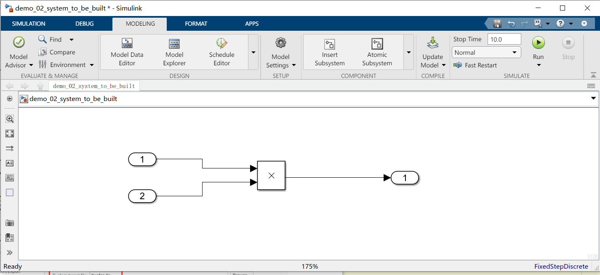
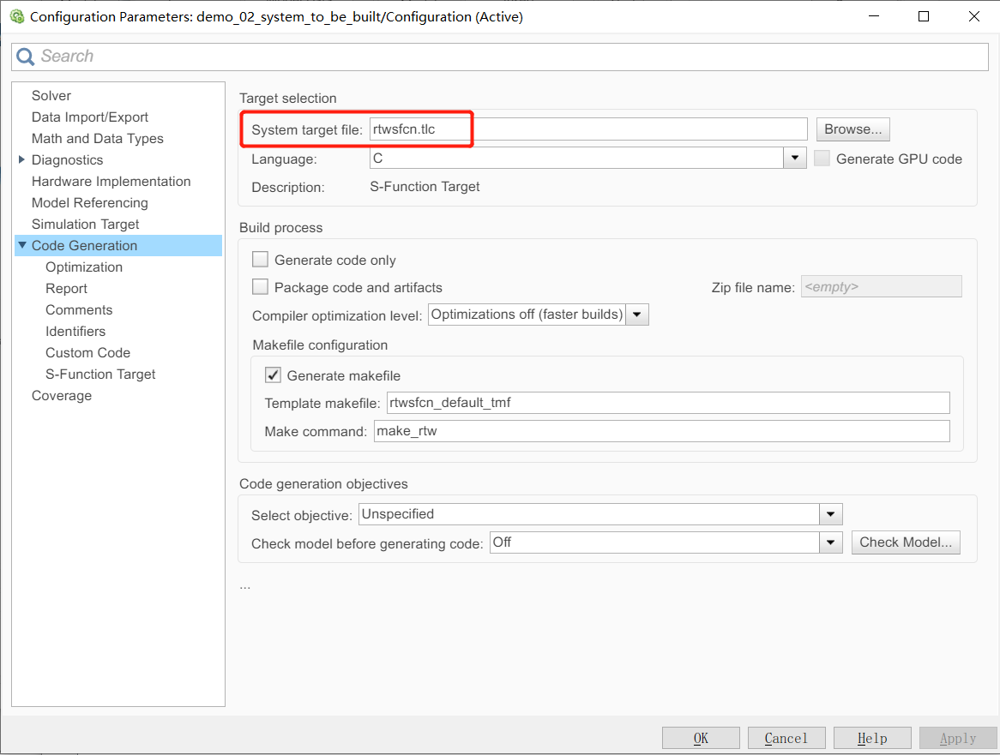
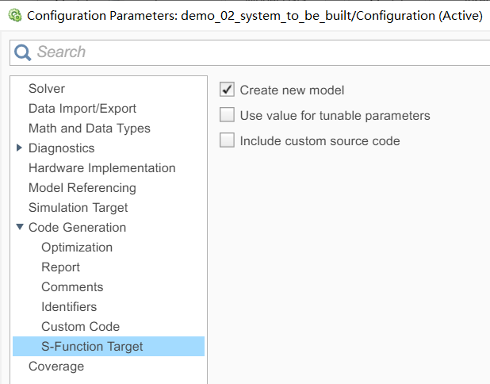
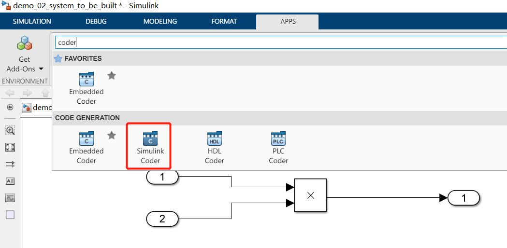
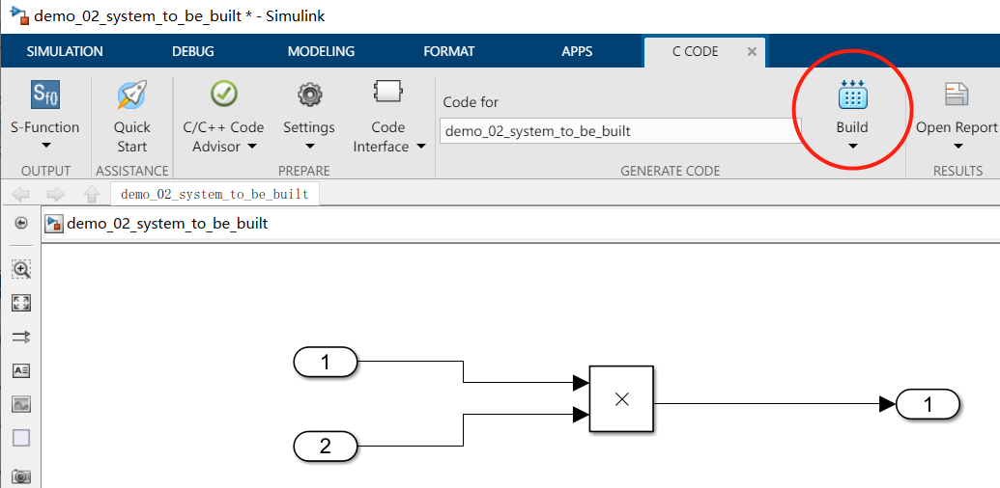
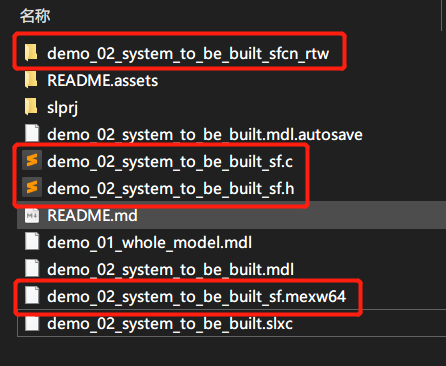
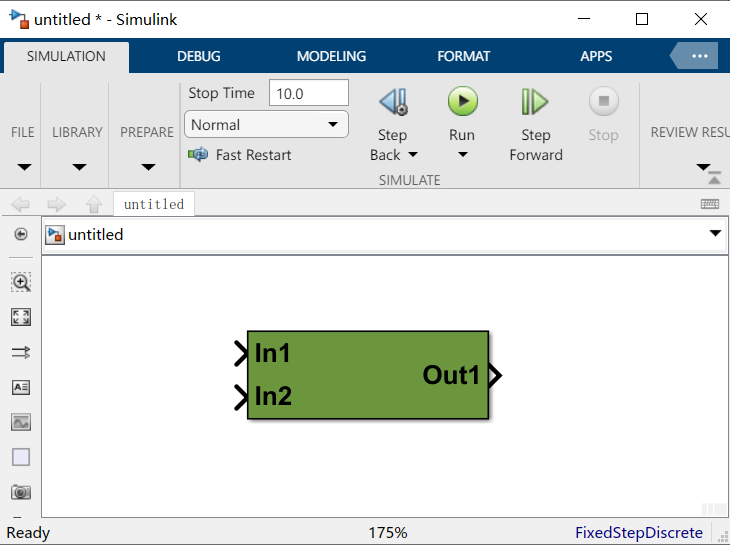
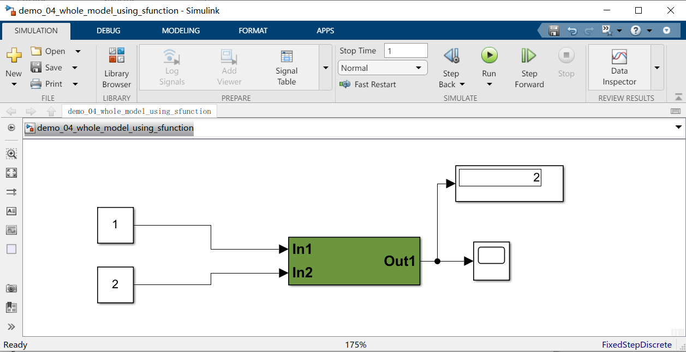
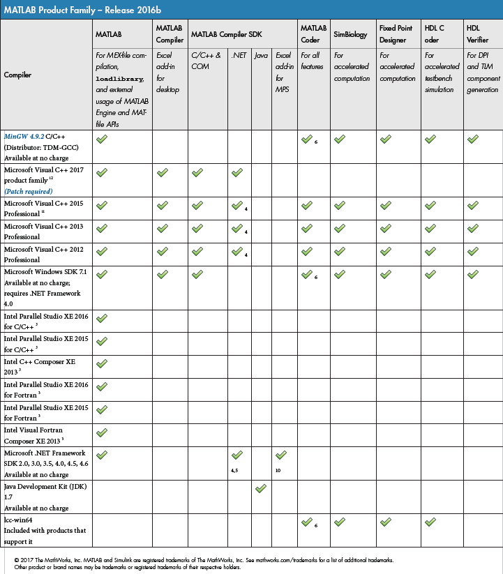

# 由Simulink model生成S-function的方法

## 1. 

### Step1: 将准备封装成S-Function的Subsystem放到一空白Model中



### Step2: 在***Model Setting***中，将***System target file***选为***S-function Target***.



### Step3: 确认勾选了***Create new model***，这样build完成的S-Function会以一个新Model的形式弹出。



### Step4: 点击Build按钮。如果Build按钮没有出现，则在App中搜索Coder，点击Simulink Coder即可调出Build按钮所在工具栏。






Build之后会产生与Model名称一致的.c/.h/.mexw64文件和一个文件夹



同时弹出一个Model，即为Build封装好的S-Function. 



## 测试结果




```bash
gcc -Wall -DRT -c *.c -I/App/MATLAB/R2020b/simulink/include/ -I/App/MATLAB/R2020b/extern/include/ -I/App/MATLAB/R2020b/toolbox/rtw/accel/accelTemplateFolder/ -I/App/MATLAB/R2020b/rtw/c/src/
```



